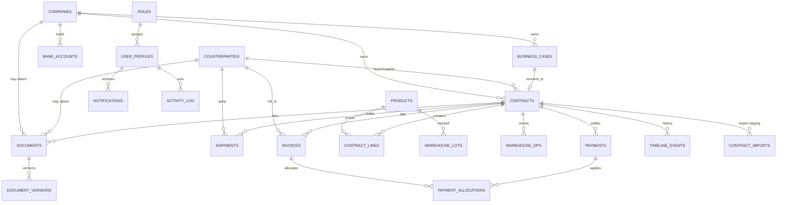

# SKY ERP — Architecture

Complete product and technical architecture for SKY ERP. This describes the target system shape. Modules marked **Planned** may not yet have full UI; their relationships are still part of the intended model.

---

## 1. System overview

```text
┌─────────────────────────────────────────────────────────────────┐
│                         Browser (ERP UI)                        │
│  App Router pages · Client views · Modals · XHR/fetch uploads   │
└────────────────────────────┬────────────────────────────────────┘
                             │
         ┌───────────────────┼───────────────────┐
         ▼                   ▼                   ▼
┌─────────────────┐ ┌─────────────────┐ ┌─────────────────────┐
│ Server Components│ │ Server Actions  │ │ Route Handlers      │
│ Data loading     │ │ DB mutations    │ │ Large uploads /     │
│ HTML composition │ │ revalidatePath  │ │ streaming / AI I/O  │
└────────┬────────┘ └────────┬────────┘ └──────────┬──────────┘
         │                   │                     │
         └───────────────────┼─────────────────────┘
                             ▼
                 ┌───────────────────────┐
                 │  Supabase (Postgres + │
                 │  Auth + Storage + RLS)│
                 └───────────┬───────────┘
                             │
              ┌──────────────┴──────────────┐
              ▼                             ▼
     ┌─────────────────┐          ┌─────────────────┐
     │ OpenAI (server) │          │ Object storage  │
     │ Files + Responses│         │ documents bucket│
     └─────────────────┘          └─────────────────┘
```

**Stack**

- Next.js App Router (React Server Components + Client Components)
- TypeScript + Tailwind CSS v4 (dark token theme)
- Supabase Postgres, Auth (SSR), Storage
- OpenAI for server-side contract PDF extraction (never from the browser)

---

## 2. Application layers

| Layer | Responsibility | Location |
| --- | --- | --- |
| Routes | URL composition, layouts, server data fetch | `src/app/(erp)/…` |
| Feature UI | Tables, filters, modals, wizards | `src/components/<module>/` |
| Platform UI | Entity workspace, timeline, documents panels | `src/components/platform/` |
| Domain lib | Actions, validation, DB helpers, formatters | `src/lib/<module>/` |
| Platform lib | Permissions, audit, search, notifications, AI glue | `src/lib/platform/`, `src/lib/ai/` |
| Infrastructure | Supabase clients, env | `src/lib/supabase/` |
| Schema | Migrations, RLS, indexes | `supabase/migrations/` |

---

## 3. Module catalog

### 3.1 Dashboard

**Purpose:** Operations snapshot — counts, attention items, shortcuts into contracts and logistics.

**Key deps:** Companies, Contracts, Logistics, Finance, Notifications.

**Status:** Present (`/dashboard`).

---

### 3.2 Companies

**Purpose:** Legal entities / subsidiaries that own contracts and bank accounts.

**Core entity:** `companies`  
**Fields (representative):** `code`, `name`, `short_name`, `country`, `city`, `tax_id`, `registration_number`, `email`, `phone`, `website`, `is_active`.

**UI:** List + detail workspace; create via modal + Server Action.

---

### 3.3 Counterparties

**Purpose:** Buyers, suppliers, consignees, agents, banks, and other partners.

**Core entity:** `counterparties`  
**Links:** Contracts (`buyer_id`, `supplier_id`, …), invoices, shipments.

---

### 3.4 Products

**Purpose:** Sellable / purchasable SKUs used on contract lines and warehouse lots.

**Core entity:** `products`  
**Features:** Manual create, import helpers, link from contract import matching.

---

### 3.5 Business Cases

**Purpose:** Pre-contract commercial opportunities; may convert into or link to contracts.

**Core entity:** `business_cases`  
**Links:** Optional `company_id`, later `contract_id`.

---

### 3.6 Contracts (hub)

**Purpose:** Central commercial agreement. Workspace tabs for overview, business case, documents, logistics, warehouse, finance, history.

**Core entities:** `contracts`, line items / product lines, workflow state, import staging (`contract_imports`).

**Inbound:** Companies, Counterparties, Products, Business Cases, PDF import (AI).  
**Outbound:** Shipments, warehouse operations, invoices/payments, documents, timeline events.

---

### 3.7 Warehouse

**Purpose:** Lots, stock movements, inbound/outbound against contracts and products.

**Core entities:** warehouse tables from module migrations (lots, operations).  
**UI:** `/warehouse`, lot detail `/warehouse/lots/[id]`, contract warehouse tab.

---

### 3.8 Logistics

**Purpose:** Shipments, transport milestones, links to contracts and counterparties.

**Core entities:** `shipments` (+ logistics extension columns).  
**UI:** `/logistics`, shipment detail, contract logistics tab.

---

### 3.9 Finance

**Purpose:** Invoices, payments, bank accounts, exchange rates, reports.

**Core entities:** invoices, payments, allocations, bank accounts, currencies/rates, expenses (as migrated).  
**UI:** `/finance` and nested routes; contract finance tab.

---

### 3.10 Documents (DMS)

**Purpose:** File library with entity attachments (company, counterparty, contract, …), versions, storage paths.

**Core entities:** `documents`, `document_versions`, Storage bucket `documents`.  
**Rules:** UUID-safe `uploaded_by`; partial upload failure must not destroy parent entities.

---

### 3.11 CRM — Planned

**Purpose:** Pipeline beyond business cases — activities, touches, account ownership, conversion analytics.

**Intended links:** Counterparties, Companies, Business Cases, Contracts, Notifications.

**Note:** Until built, do not invent CRM tables in feature PRs; propose a migration via the module template.

---

### 3.12 Notifications

**Purpose:** In-app alerts for approvals, shipment events, payment due, import completion.

**Core entities:** `notifications` (platform migration).  
**Consumers:** Header / dashboard / entity activity.

---

### 3.13 Settings

**Purpose:** Organization preferences, roles surface, integration status (AI keys presence, etc.).

**UI:** `/settings`.  
**Related:** Permissions / roles tables from platform migration.

---

### 3.14 AI Assistant

**Purpose:** Operator-facing assistant for Q&A and guided actions; contract PDF import uses dedicated server AI pipeline.

**Rules:** Keys only on server (`CONTRACT_AI_API_KEY` / `OPENAI_API_KEY`). Large PDFs via `/api/contracts/import`, not Server Actions. Human review before create.

---

### 3.15 Analytics — Planned

**Purpose:** Cross-module reporting: margin by contract, logistics SLA, inventory turns, AR/AP aging.

**Intended sources:** Contracts, Finance, Warehouse, Logistics (read models / SQL views).  
**UI:** Prefer Finance Reports first, then a dedicated Analytics area.

---

### 3.16 Permissions

**Purpose:** Role-based capability checks (`assertCan`, roles, user profiles).

**Core entities:** `roles`, `user_profiles` (and related).  
**Usage:** Gate writes in Server Actions and sensitive Route Handlers; evolve UI affordances to match.

---

## 4. Cross-cutting platform services

| Service | Role |
| --- | --- |
| Timeline | Chronological entity events |
| Activity / audit | `recordEntityEvent` and activity log |
| Documents | Attach / preview / delete across entities |
| Search | Global / header search aggregation |
| Linked entities | Graph of related records for workspace |
| Entity bundle | Loads timeline + docs + linked for detail pages |
| Permissions | Capability matrix |
| Notifications | Alert delivery store |

---

## 5. Contract hub pattern

Contracts are the integration spine:

```text
Business Case ──┐
Company ────────┤
Buyer/Supplier ─┼──► Contract ──┬──► Shipments (Logistics)
Products ───────┤               ├──► Warehouse operations / lots
PDF Import ─────┘               ├──► Invoices / Payments
                                ├──► Documents
                                └──► Timeline / Activity
```

UI implication: `/contracts/[id]/*` tabs compose module-specific panels while sharing one contract header/shell.

---

## 6. Relationships diagram



---

## 7. Data flow patterns

### 7.1 Standard CRUD module

1. Server page loads list via `getX()`.
2. Client `XView` owns filters + “New” button.
3. Modal collects fields → Server Action `createX` → Supabase insert.
4. `revalidatePath` + `router.refresh()` + toast.

### 7.2 Large file / AI import

1. Browser multipart upload to Route Handler (progress via XHR).
2. Handler stores file in Supabase Storage, calls OpenAI Files + Responses.
3. Persist extraction JSON to staging table; stream NDJSON progress.
4. Review UI (unchanged human confirmation) → Server Action creates contract + lines + document link.

### 7.3 Entity workspace

1. Detail page loads entity + `getEntityWorkspaceBundle`.
2. `EntityWorkspace` renders overview slot + shared panels (timeline, documents, linked, financials as applicable).

---

## 8. Security architecture

```text
Browser ──publishable key / session cookies──► Supabase
                ▲
                │ SSR cookie session
Next server ────┘
                │
                ├── RLS policies enforce row access
                └── OpenAI keys only in server env
```

- No OpenAI from client.
- No service role in app runtime.
- Permissions layer adds app-level gates before mutations.

---

## 9. Navigation map (current shell)

| Nav label | Route |
| --- | --- |
| Dashboard | `/dashboard` |
| Business Cases | `/business-cases` |
| Companies | `/companies` |
| Counterparties | `/counterparties` |
| Products | `/products` |
| Contracts | `/contracts` |
| Logistics | `/logistics` |
| Warehouse | `/warehouse` |
| Finance | `/finance` |
| Documents | `/documents` |
| AI Assistant | `/ai` |
| Settings | `/settings` |

Planned modules (CRM, Analytics) get nav entries only when a minimal vertical slice ships.

---

## 10. Evolution rules

1. New domain capability → new migration + `src/lib/<module>` + UI under `src/components/<module>` + route under `src/app/(erp)/`.
2. Cross-cutting UI → `platform`, not copy-paste across modules.
3. Prefer extending the contract hub over inventing a second spine.
4. Update this document when a Planned module becomes Present.

---

## Related documents

- [PROJECT_STANDARDS.md](./PROJECT_STANDARDS.md)
- [DATABASE_GUIDELINES.md](./DATABASE_GUIDELINES.md)
- [MODULE_TEMPLATE.md](./MODULE_TEMPLATE.md)
