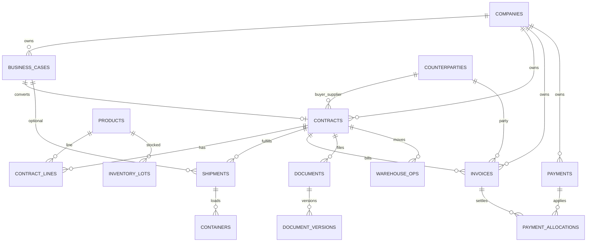

# SKY ERP — Data Model

Enterprise description of core entities, fields of record, and relationships. Align TypeScript types and migrations with this model; never invent columns that do not exist in Supabase.

---

## 1. Modeling principles

- UUID primary keys
- `created_at` / `updated_at` on durable tables
- `created_by` / `updated_by` as uuid → `auth.users` when attribution matters
- Soft delete or `is_active` for operational enablement (see Database Guidelines in `/docs`)
- Foreign keys are explicit; contract is the integration hub
- Files live in Storage; DB stores metadata paths

---

## 2. Companies

**Table:** `public.companies`  
**Meaning:** Legal entities that own deals, accounts, and often inventory.

| Column | Role |
| --- | --- |
| `id` | PK |
| `code` | Unique short code |
| `name` | Legal / display name |
| `short_name` | Abbreviation |
| `country`, `city` | Location |
| `tax_id`, `registration_number` | Statutory IDs |
| `email`, `phone`, `website` | Contact |
| `is_active` | Operational flag |
| `created_at`, `updated_at` | Audit timestamps |

**Relationships**

- 1 → * Contracts (`company_id`)
- 1 → * Business Cases
- 1 → * Bank Accounts
- 1 → * Documents (optional typed FK / entity link)

---

## 3. Counterparties

**Table:** `public.counterparties`  
**Meaning:** Buyers, suppliers, consignees, agents, banks, other partners.

| Column (representative) | Role |
| --- | --- |
| `id` | PK |
| `code` | Optional unique code |
| `legal_name` | Required legal name |
| `short_name` | Trade name |
| `counterparty_type` | Buyer / Supplier / … |
| `country`, `city`, `address` | Location |
| `tax_id`, `registration_number` | Statutory IDs |
| `email`, `phone`, `website` | Contact |
| `is_active` | Operational flag |

**Relationships**

- * ← Contracts as `buyer_id`, `supplier_id`, consignee fields as modeled
- * ← Invoices as bill-to / supplier parties
- * ← Shipments as logistics parties when applicable
- * ← Documents

---

## 4. Products

**Table:** `public.products`  
**Meaning:** Sellable / purchasable seafood SKUs and attributes.

| Column (representative) | Role |
| --- | --- |
| `id` | PK |
| `sku` | Unique SKU |
| `name` | Commercial name |
| `scientific_name` | Species |
| `category` | Grouping |
| `country` | Origin |
| `size` | Size grade |
| `purchase_price`, `sale_price`, `currency` | Pricing hints |
| `image_url` | Media |
| `is_active` | Flag |

**Relationships**

- * ← Contract product lines
- * ← Warehouse lots / inventory
- Used in AI import product matching

---

## 5. Business Cases

**Table:** `public.business_cases`  
**Meaning:** Pre-contract commercial opportunity / deal shell.

| Column (representative) | Role |
| --- | --- |
| `id` | PK |
| `case_number` | Human identifier |
| `title` | Short name |
| `case_type` | Classification |
| `company_id` | Owning company |
| Buyer / supplier / consignee FKs | Parties |
| `status` | Pipeline status |
| `contract_number`, `contract_amount`, `currency` | Commercial snapshot |
| `incoterms`, `contract_date` | Terms snapshot |

**Relationships**

- * → 0..1 Contract (conversion / link)
- * → Shipments (optional early link)
- Owned by Company; parties are Counterparties

---

## 6. Contracts

**Tables:** `public.contracts` + line / hub-related tables  
**Meaning:** Binding commercial agreement — **system hub**.

| Column (representative) | Role |
| --- | --- |
| `id` | PK |
| `contract_number` | Unique number |
| `title` | Description |
| `company_id` | Owner |
| `buyer_id`, `supplier_id` | Parties |
| `business_case_id` | Optional origin |
| `contract_date`, `expiry_date` | Validity |
| `currency`, `amount` | Commercial total |
| `status` | Lifecycle |
| Incoterms / payment / delivery fields | As migrated |

**Child / hub concepts**

- Contract product lines
- Contract imports (`contract_imports`) — AI staging
- Workspace tabs: documents, logistics, warehouse, finance, history

**Relationships**

```text
Company ──owns──► Contract
Buyer/Supplier ──party──► Contract
Business Case ──converts──► Contract
Contract ──contains──► Lines (Products)
Contract ──fulfills──► Shipments
Contract ──moves──► Warehouse ops / lots
Contract ──bills──► Invoices
Contract ──files──► Documents
Contract ──history──► Timeline / Activity
```

---

## 7. Shipments

**Table:** `public.shipments` (+ logistics extension columns)  
**Meaning:** Executable transport movement.

| Column (representative) | Role |
| --- | --- |
| `id` | PK |
| `contract_id` | Hub link |
| `business_case_id` | Optional |
| `container` | Container number (legacy/simple field) |
| `vessel`, `voyage` | Carrier schedule |
| `port_of_loading`, `port_of_destination` | POL / POD |
| `etd`, `eta` | Schedule |
| `status` | Logistics status |
| `tracking_number` | Carrier tracking |

**Relationships**

- * → Contract
- * → Business Case (optional)
- Documents, timeline events
- Future: first-class Containers entity (see below)

---

## 8. Containers

**Status in product:** Partially represented today via shipment `container` (and stuffing details in docs/ops). Target model:

**Intended table:** `public.containers` (roadmap)

| Column (target) | Role |
| --- | --- |
| `id` | PK |
| `shipment_id` | Parent shipment |
| `container_number` | BIC code |
| `seal_number` | Seal |
| `size_type` | e.g. 40RF |
| `net_weight`, `gross_weight` | Weights |
| `tare_weight` | Tare |

**Relationships**

- * → 1 Shipment
- * ← Stuffing lines → Warehouse lots / contract lines

Until the table exists, treat container number on shipment + documents as the operational record.

---

## 9. Warehouse

**Tables:** inventory lots / warehouse operations (see warehouse migrations)  
**Meaning:** Cold-chain stock and movements.

**Lot (representative)**

| Concept | Role |
| --- | --- |
| `lot_number` | Identifier |
| `product_id` | SKU |
| Quantity / UOM | On-hand |
| `status` | Available / Hold / Shipped |
| Contract / receipt refs | Provenance |

**Operations**

- Inbound, outbound, adjustment, transfer
- Must reference product and quantity; outbound linked to contract/shipment when shipping export cargo

**Relationships**

- Lot → Product
- Ops → Lot, optional Contract / Shipment

---

## 10. Invoices

**Table:** `public.invoices` (+ `invoice_items`)  
**Meaning:** AR/AP commercial documents.

| Column (representative) | Role |
| --- | --- |
| `id` | PK |
| `invoice_number` | Unique |
| `invoice_type` | Sales / Purchase / Proforma / Credit |
| `company_id` | Owner |
| `contract_id`, `business_case_id` | Links |
| `buyer_id`, `supplier_id` | Parties |
| `currency`, `amount` | Totals |
| `paid_amount`, `outstanding` | Settlement |
| `due_date`, `status` | Collection |

**Relationships**

- * → Contract, Company, Counterparties
- 1 → * Invoice items
- * ← Payment allocations

---

## 11. Payments

**Tables:** `public.payments`, `payment_allocations`  
**Meaning:** Cash movements and application to invoices.

| Concept | Role |
| --- | --- |
| Payment header | Amount, currency, date, bank account, company |
| Allocation | Payment ↔ Invoice amount applied |

**Relationships**

- Payment → Company, Bank Account
- Allocation → Invoice, Payment

---

## 12. Documents (DMS)

**Tables:** `public.documents`, `public.document_versions`  
**Storage:** Supabase bucket `documents`

| Concept | Role |
| --- | --- |
| Document | Title, type, entity link, current file metadata |
| Version | Immutable file revision |
| Entity link | `entity_type` + `entity_id` and/or typed FKs (`company_id`, `contract_id`, …) |
| `uploaded_by` | uuid only |

**Relationships**

- Polymorphic attach to Company, Counterparty, Contract, Shipment, etc.
- Contract import PDFs may stage under imports path before linking

---

## 13. Relationship diagram



---

## 14. Platform entities (supporting)

| Entity | Role |
| --- | --- |
| `timeline_events` | Chronology on entities |
| `activity_log` | Audit / activity |
| `notifications` | In-app alerts |
| `roles` / `user_profiles` | Permissions |
| `contract_imports` | AI PDF staging |

---

## Related knowledge

- [01_BUSINESS_RULES.md](./01_BUSINESS_RULES.md)
- [05_DOMAIN_TERMS.md](./05_DOMAIN_TERMS.md)
- `/docs/DATABASE_GUIDELINES.md`
